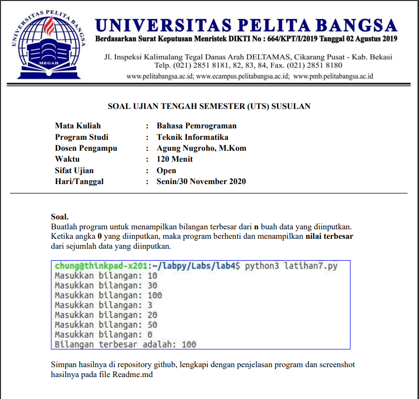
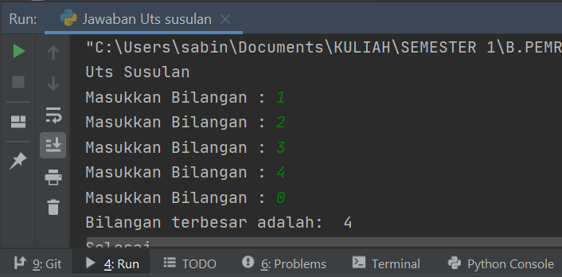

# Uts-Susulan-312010039
Untuk memenuhi nilai uts susulan

soal UTS Susulan



# Penjelasan

> Berikut adalah penggunaan while untuk Perulangan Random
```python
print("Uts Susulan")

xangka=0
while True:
    xbilangan = int(input("Masukkan Bilangan : "))
    if (xangka < xbilangan):
        xangka=xbilangan
    if (xbilangan == 0):
        break

print("Bilangan terbesar adalah: ",xangka)
print()
```

> Hasil run



> a=0
<br>while :
<br>input --> nama/yang akan di input b=input(int(masukan nilai : ))
<br>if (yang akan di input ): Perulangan random : a=b --> untuk keterangan perulangan
<br>if(hasil b==0)

> penggunaan perintah break --> b==0 agar ketika memasukan 0 input random terhenti dan menapilkan hasil pada print bagian bawah

--------------------------------------------------------------------------
Nama    : Sandi Bintara

NIM     : 312010039

Kelas   : TI 20 b1